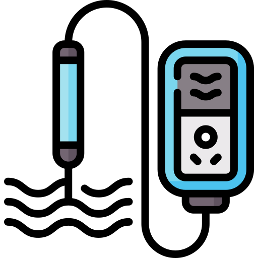
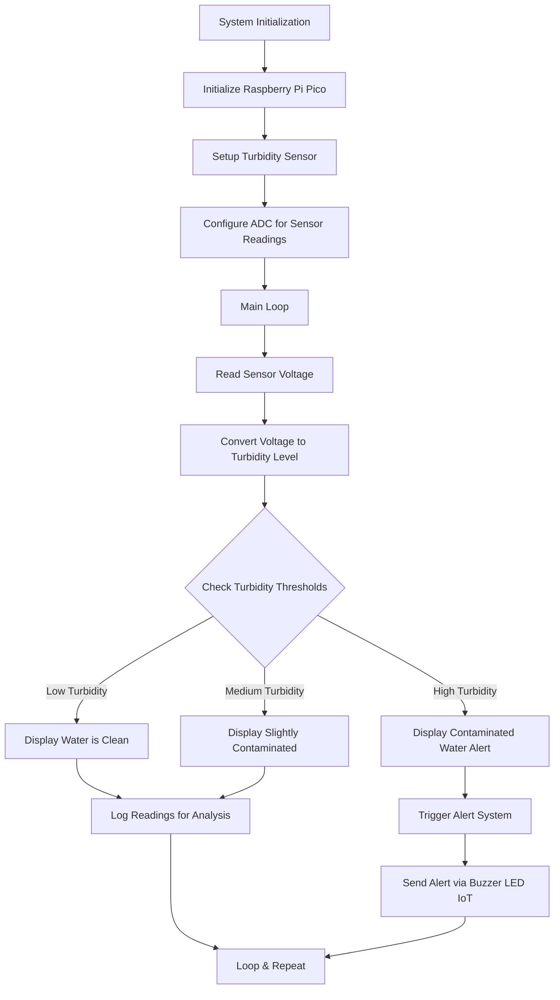

<h1 align="center">Smart Water Quality Meter</h1>

  

  
<h2>📚 Table of Contents (Click to Expand)</h2>

- [1. Project Overview](#1-project-overview)
  - [📌 Problem Statement](#-problem-statement)
  - [✅ Merits of the Project](#-merits-of-the-project)
- [2. What We're Using 🔧](#2-what-were-using-)
  - [🛠️ Hardware Components](#️-hardware-components)
  - [💻 Software Tools](#-software-tools)
- [3. Steps on How It Works ⚙️](#3-steps-on-how-it-works-️)
  - [a) **Working Principle of the Turbidity Sensor (DF Robot SEN0189)**](#a-working-principle-of-the-turbidity-sensor-df-robot-sen0189)
- [📊 Comparison Flowchart (Water Quality Meter)](#-comparison-flowchart-water-quality-meter)
  - [b) **Procedure of Data Collection**](#b-procedure-of-data-collection)
    - [1. **Hardware Setup**](#1-hardware-setup)
    - [2. **Software Setup**](#2-software-setup)
    - [3. **Programming**](#3-programming)
    - [4. **Data Interpretation**](#4-data-interpretation)
- [4. More About the Sensor 📖](#4-more-about-the-sensor-)
  - [DF Robot SEN0189 Turbidity Sensor](#df-robot-sen0189-turbidity-sensor)
  - [📝 Notes](#-notes)
- [📂 Folder Structure (Optional for GitHub Repo)](#-folder-structure-optional-for-github-repo)

## 1. Project Overview

### 📌 Problem Statement
Access to clean and safe drinking water is a fundamental need, yet many regions lack the infrastructure to monitor water quality efficiently. Manual water quality testing is time-consuming, costly, and requires expertise. There is a need for a **low-cost**, **real-time**, and **automated** solution to **continuously monitor water quality**, especially in remote areas.

### ✅ Merits of the Project
- **Cost-effective** solution for water quality monitoring.
- **Real-time data** collection and analysis.
- Portable and easy to deploy in various environments.
- Can be integrated with **alert systems** or **IoT platforms** for remote monitoring.
- Promotes **clean water initiatives** and helps detect contamination early.

---

## 2. What We're Using 🔧

### 🛠️ Hardware Components
- **Turbidity Sensor**: DF Robot **SEN0189**
- **Microcontroller**: Raspberry Pi Pico
- **Connecting Wires** and **Breadboard**
- **Power Supply**: USB (from PC)

### 💻 Software Tools
- **Thonny IDE**: Python IDE for coding and interfacing with Raspberry Pi Pico.
- **MicroPython Firmware**: To run Python code directly on the Raspberry Pi Pico.

---

## 3. Steps on How It Works ⚙️

### a) **Working Principle of the Turbidity Sensor (DF Robot SEN0189)**

1. **Light Emission**: The sensor emits an **infrared light** through the water sample.
2. **Light Scattering**: Suspended particles in the water **scatter** the light.
3. **Detection**: A photodetector inside the sensor measures the **scattered light intensity**.
4. **Voltage Output**: Based on the amount of light detected, the sensor outputs an **analog voltage**.
5. **Turbidity Measurement**: The Raspberry Pi Pico reads this analog voltage and converts it into a **turbidity value**, typically expressed in **NTU (Nephelometric Turbidity Units)**.

---
## 📊 Comparison Flowchart (Water Quality Meter)

---
### b) **Procedure of Data Collection**

#### 1. **Hardware Setup**
- Connect the **VCC** of the SEN0189 to the **3.3V** pin of the Raspberry Pi Pico.
- Connect **GND** to **GND** on the Pico.
- Connect the **Analog Output (A0)** of the sensor to **ADC0 (GP26)** on the Pico.

#### 2. **Software Setup**
- Install **Thonny IDE** on your laptop.
- Flash the **MicroPython UF2** firmware onto the Raspberry Pi Pico.
- Open Thonny and select **MicroPython (Raspberry Pi Pico)** as the interpreter.

#### 3. **Programming**
- Write a Python script in Thonny to:
  - Read **analog values** from the sensor via the **ADC** pin.
  - Convert the analog signal into a **voltage** value.
  - Interpret voltage levels to determine **water clarity** (clean or dirty).

#### 4. **Data Interpretation**
- Based on the sensor output:
  - **Low turbidity (clean water)** gives **low voltage** readings.
  - **High turbidity (dirty water)** gives **high voltage** readings.
- Set thresholds to trigger **alerts** or **indicators** if turbidity crosses a critical level.

---

## 4. More About the Sensor 📖

### DF Robot SEN0189 Turbidity Sensor

| Feature        | Description                           |
|----------------|---------------------------------------|
| **Operating Voltage** | 5V (but compatible with 3.3V logic) |
| **Output Signal**     | Analog Voltage                  |
| **Measurement Range** | 0 - 1000 NTU                   |
| **Interface**         | 3-pin (VCC, GND, Signal)       |
| **Applications**      | Water quality monitoring, sewage detection, environmental testing |

### 📝 Notes
- The **SEN0189** is **easy to interface** with microcontrollers using analog input pins.
- It is **sensitive to suspended particles** and can detect even small changes in water turbidity.
- Calibration may be required to convert raw voltage readings into accurate **NTU values**, depending on the application.

---

## 📂 Folder Structure (Optional for GitHub Repo)

